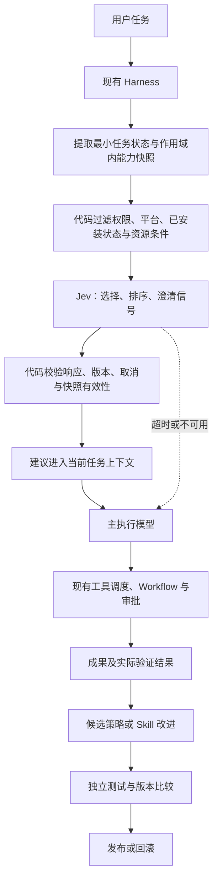

# Atelier：Jev 与 Harness 接入评估

核查日期：2026-09-27。范围：当前工作树及已安装的 `@deepseek-ai/dsh-* 0.1.5-rc.2`；只读源码核查和方案设计，未调用收费 API、修改运行时代码或部署。工作树已有其他改动，全部保留。

## 1. 结论

建议引入 Jev 作为 Harness 内的语义决策服务，先验证 **已有能力的选择与建议**，之后再接能力扩展和改进闭环。主执行模型继续负责规划、写代码、创作和解释；Harness 继续负责工具调度、权限、会话、取消和持久化。

Jev 可以在给定候选中选择、评分或判断条件，但不提供自由文本生成。因此，不能单靠 Jev 生成新 Skills、规划任意任务图或“自动进化”系统代码。下面是设计建议，不是已接入能力。

## 2. 官方能力与接入条件

依据 [System One](https://docs.typesafe.ai/concepts/system-one)、[API](https://docs.typesafe.ai/api)、[Models](https://docs.typesafe.ai/models)：

- 服务端调用 `POST https://api.typesafe.ai/v1/systemone`，Bearer API Key；请求含 `model`、`state`、`questions`，响应含 `model`、`answers`、`usage`。
- Choice 从限定选项中选择；Score 依据描述性等级评分；Noul 返回条件成立的概率。Choice/Score 的 confidence 来自分布，不等于业务正确率或操作授权。
- 当前官方版本为 `jev-1.13.0`；实验固定版本，记录实际响应版本，避免 alias 更新干扰对照。
- 当前仅接收文本；3D 结构、渲染图的视觉质量必须另行验证。官方说明英语表现最好，法文必须单独测量。
- 当前价格为每百万输入 token $0.042，输出免费；官方列出 1200 请求/分钟、250000 token/秒，并明确额度可能调整。采购或上线时重新核对账号实际额度。
- 官方不提供用户数据微调/LoRA；领域适配通过 state、问题和 criteria 完成。这里的“进化”指应用策略与 Skills 的版本改进，不是 Jev 权重自训练。

官方 [已知限制](https://docs.typesafe.ai/model-jaggedness/jev-1.13) 提醒：算术、日期比较、多层间接推理、无关长上下文和恶意输入可能出错。精确计算、依赖检查、权限与版本冲突留在代码中。[数据处理条款](https://typesafe.ai/legal/data-processing) 与 [隐私政策](https://typesafe.ai/legal/privacy-policy) 已查看；不训练客户数据不等于所有账号零留存。企业 ZDR 需要另行确认，首轮只使用人工编写的非敏感样例。

## 3. 现有能力与缺口

路径均相对于仓库根目录。

| 能力 | 已核查实现 | 现状与缺口 |
| --- | --- | --- |
| 桌面 Harness 宿主 | `src/main/runtime/harness-runtime.ts`、`docs/architecture.md` | Electron 管理独立 Harness 进程；不另建 Agent runtime |
| Agent 工具调度 | `node_modules/@deepseek-ai/dsh-agent-loop/lib/index.js`：`executeToolCalls` | 已有并发安全模式和独占屏障；Jev 不应重写这些执行规则 |
| 调度扩展事件 | `node_modules/@deepseek-ai/dsh-agent/lib/types/runtime-types.d.ts` | `agent/pre-step` 可异步处理步骤输入；`agent/request` 可替换模型配置；`agent/request-error` 可参与恢复。需真实加载验证，声明存在不等于插件已运行 |
| 上下文贡献 | `node_modules/@deepseek-ai/dsh-system-prompt/lib/types/index.d.ts` | `context()`、`system-prompt/assemble` 可供建议进入上下文；按 agent/session 存储，不能写全局共享建议 |
| 模型执行 | `@deepseek-ai/dsh-llm`、`dsh-agent-default-model`、`build/atelier-preset/agent.cordis.yml` | 已有主模型选择；Jev 的决策接口与生成接口不同，应单独适配，不直接当作聊天模型 |
| Skills 注册与发现 | `@deepseek-ai/dsh-skill/lib/types/index.d.ts`、`dsh-skill-filesystem/lib/types/index.d.ts` | `snapshot/list/get`、作用域、变更事件、取消与按需加载已有；未发现 Jev 选择、版本晋升或效果改进闭环 |
| Atelier 内置 Skill | `build/atelier-preset/skills/atelier-blender-workflow/SKILL.md` | 当前此目录只有一个 Skill。已有 Blender 检查、双视图、可编辑文件交付要求；小目录下规则可能足够，不能预设 Jev 一定收益更高 |
| Workflow 与子任务 | `build/atelier-preset/agent.cordis.yml` delegation；`@deepseek-ai/dsh-workflow/lib/types/index.d.ts` | 已组合 spawn/fork、worker-thread Workflow；有开始/结束/取消及上限错误语义。复杂计划仍由执行模型形成，代码校验依赖与预算 |
| MCP 配置 | `packages/dsh-desktop-market-installer/mcp-connectors.mjs` | 12 个精选条目，3 个默认配置配方；写入 preset YAML、临时文件 rename、重复检查。配置状态仅检查条目存在，没有联网健康证明、自动能力匹配或版本晋升 |
| MCP 实际工具 | `@deepseek-ai/dsh-mcp-client/lib/types/index.d.ts` | stdio/Streamable HTTP、命名空间、连接、初始工具同步、断开注销与重连已有；后续推荐必须使用实际工具发现与健康状态 |
| MCP 写入入口 | `packages/dsh-desktop-market-installer/index.js`：`MCP_CONNECTOR_PATH` handler | GET/POST 信任检查、请求大小限制、写入串行化已有；校验命令参数形式不等于来源审查或允许自动执行任意程序 |
| 插件安装发布 | `packages/dsh-desktop-market-installer/generations/`、`docs/patch-plugin-contract.md` | 已有插件 generation 流程；MCP 配置与 Skill 文件不是同一种发布物，不能声称都已具备统一回滚事务 |
| 云端隔离与资源 | `scripts/web-cloud/gateway.mjs`、`runtime.mjs`、`runner.mjs` | 当前匿名 Cookie 映射独立容器/卷；不是 Atelier 登录账号。active Map 有容量上限，未见闲置回收和跨节点调度；容器限制 1536 MiB、1.5 CPU、192 PIDs |
| 云端密钥注入 | `scripts/web-cloud/runner.mjs` | 子进程环境使用显式字段，不会自动传递宿主 `TYPESAFE_API_KEY`。需独立的服务端凭据适配，不能以透传整个环境解决 |

## 4. 推荐架构

### 进程和服务边界

- 建议新建自有服务插件 `atelier-decision-router`（暂定名），在 Harness 服务端运行，桌面与云端复用。UI 只展示开关和建议状态，不持有 TypeSafe 密钥。
- 第一阶段挂载于 Atelier preset 的 scope，复用 `skills.snapshot()`、工具目录和 `agent/pre-step`。结果经现有上下文贡献接口进入主模型；不要 monkey-patch AgentLoop 内部方法。
- 初期只在新用户任务触发一次建议；不在 token 流、每次工具调用或页面请求中调用 Jev。首个实验使用离线快照；真实挂载时测试取消、热重载和作用域生命周期。
- `agent/request` 是未来模型路由的候选接缝，第一阶段保留用户选定模型；自动切换只能在用户允许的提供商和模型清单内进行，不自动新增计费账号。
- Jev 不决定用户身份、跨租户访问、可用内存、容器数或工具并发安全；这些仍由代码和宿主控制。

### 建议契约（待实现）

输入包含：任务文本、必要的最近上下文、scope 内 Skill 摘要、实际可用 MCP 工具、平台限制、能力目录版本。排除 API Key、Cookie、无关历史与完整用户文件。

输出包含：候选 ID 或 `none`、各候选分布、confidence/相关 Noul、模型版本、用量、耗时、任务及目录快照标识。记录目录版本用于过期检查；实现时需定义稳定摘要，不能假定 Skills 已有公开 revision 字段。

调用结果只可引用原候选集合。选择未知 ID、响应不合法、取消、目录变化、超时、401、429 或 529 时，不执行新动作，继续原 Harness 流程。正常任务不依赖 Jev 可用性。首轮建议调用超时预算可先设 2 秒作为待测参数，不作为已达到的 SLA。

## 5. 一次任务如何流转

示例：“制作一件几何雕塑，交付可编辑 Blender 文件和两张不同视角预览。”

1. Harness 取得当前 agent、workspace 与已授权工具；代码读取作用域内 Skill 摘要。
2. 判断运行条件：桌面 Blender MCP 的本机状态与云端 Linux 容器不同。配置中有 Blender 条目，不代表 Blender/add-on 正在运行。
3. Jev 在候选中推荐 `atelier-blender-workflow` 或 `none`；缺失艺术要求的语义判断可作为独立问题。材料、尺寸和文件存在性仍由解析/工具验证。
4. 返回建议，经主模型决定是否加载 Skill。第一阶段不自动安装任何新组件。
5. 执行模型按 Skill 调用 Blender 状态工具。不可用时说明缺失条件；云端不能把用户电脑的 `127.0.0.1:9876` 当作自身地址。
6. 条件齐备后沿用 Harness 完成建模、保存、渲染和导出；每个成果单独验证。Jev 的文本判断不能替代渲染图视觉检查。
7. 如果任务失败，代码记录真实错误分类；生成模型提出下一步，Jev可在明确候选中协助选择。重试次数、可重复执行条件和取消仍由代码控制。

## 6. MCP/Skills 扩展与“自进化”的具体范围

| 层级 | 可实现行为 | 验证与发布边界 |
| --- | --- | --- |
| 调度策略改进 | 改善 shortlist、问题描述和候选排序 | 固定样例与保留集对照；策略版本可回退；不从一次成功得出通用规则 |
| Skill 改进 | 生成模型根据失败实例提出 Skill 文件修订，Jev辅助匹配或文本评价 | 独立目录测试、资源引用验证、真实任务与成果验证；用户手改不自动覆盖 |
| MCP 扩展 | 从维护的目录检索候选，Jev 排序，再配置连接 | 来源/版本/依赖/权限由程序和现有授权检查；分别证明下载、配置、连接、工具发现和实际调用 |
| 系统代码修改 | 生成模型提出实现补丁 | 走普通开发、测试、发布流程；不作为运行时自修改入口 |

远端 README、MCP 返回文本和 Skill 材料都是待检查数据，不是操作授权。官网也承认恶意 state 可能影响 Jev 判断；高置信度不能绕过现有审批。

预授权范围内可自动复用已连接的工具或加载已有 Skill。安装新程序、传递新凭据、启用新网络目的地及扩大权限必须满足已有用户授权；缺少授权时只建议。白名单内也要固定来源和版本，避免自动 `npx -y` 跟随未知最新版。

## 7. 桌面端与 Web Cloud 差异

| 项目 | 桌面端 | Web Cloud |
| --- | --- | --- |
| TypeSafe 调用 | Harness 服务端请求；凭据通过服务端适配提供 | tenant runner 或专用决策服务请求；网关不把凭据发给浏览器 |
| 第一轮密钥 | 独立测试环境中的 TypeSafe 专用 key | 暂不部署，不复用用户 DeepSeek key |
| MCP 运行 | 可连接本机程序，但仍检查依赖与权限 | 只使用容器内依赖或明确授权的远端连接；本机 Blender 通常不可达 |
| Skill 文件 | 用户/project/preset 的作用域与优先级保留 | 限定当前 tenant 的卷，禁止其他用户内容进入候选或改进缓存 |
| 并发与预算 | 与当前任务取消/应用生命周期相连 | 分别控制 tenant 请求、平台总请求和服务商额度；匿名用户需限制滥用 |
| 用户身份 | 本机 Profile | 当前匿名 Cookie；之后账号同步是独立工程，不能用 Jev 替代 |

建议先使用远端 Jev API，不在现有小内存服务器上部署另一套模型推理。它不能减少常驻 Harness 容器的基本内存，更不能单独解除 `AT_CAPACITY`。10000 个注册用户、在线浏览器和同时执行的用户应分别建模。

## 8. 分阶段实施与第一阶段改动范围

### 阶段一：能力推荐实验

- 在开发用独立 Profile 中实现 TypeSafe HTTP 适配、响应校验、候选筛选、建议缓存与取消。
- 新插件源码放 `packages/atelier-decision-router/`（建议位置），维护 package manifest、服务端入口及声明；不增加独立 UI 框架。
- 实验入口放 `scripts/experiments/`，仅使用非敏感 fixtures；契约与生命周期测试放 `test/`。
- 先离线评估，再用临时 preset 挂载测试；不改默认 preset、不改线上部署配置。需要真实插件生命周期、安装闭包和回退检查。
- 保留全量能力目录与主模型判断，不强制加载 Jev 推荐；关闭插件即恢复原流程。

### 阶段二：任务与模型路由

阶段一证明价值后，接入用户允许的模型路由、明确的 Workflow 模板及失败候选。任务图、成本计算、循环上限与幂等验证由程序承担。

### 阶段三：受控能力扩展

先补 MCP 的 configured/connected/healthy 状态、版本配方和独立连接测试，再接目录检索与推荐。自动配置与实际激活是不同阶段，不能把 POST 返回成功当作工具可用。

### 阶段四：持续改进

先做策略与 Skill 候选版本：问题实例 → 修订提案 → 临时环境任务验证 → 保留集比较 → 发布/回退。效果记录只收集必要字段，不跨用户汇总私有素材；不自动修改系统代码或模型权重。

## 9. 最小可证伪实验

### 任务与样本

以“几何雕塑/展览场景的可编辑 3D 交付”为主任务，增加博物馆资料检索、文档整理、普通问答和无匹配任务作为反例。先编写 24 个非敏感输入（英文/法文各 12），涵盖明确请求、模糊请求、无匹配、缺少工具、配置但未连接、取消和外部材料诱导安装。分为 12 个调试集与 12 个保留集；同义改写不得跨集合泄漏。

这些是拟编写样例，不是假称已经存在的用户数据或已完成基准。

### 对照

1. A：当前 Harness/主模型能力选择。
2. B：简单规则 + 当前 Harness。
3. C：同一候选目录 + Jev建议 + 当前 Harness。

锁定主模型、语言、工具目录、权限及运行环境；Jev 固定 `jev-1.13.0`。多项都合适时，标注可接受候选集合；不能强行以唯一标签惩罚合理选择。由人审定需要哪个 Skill/工具及是否应澄清。

先比较推荐层，再对每种语言至少选一个相同的完整 3D 任务做端到端对照。若没有可用 Blender，完成推荐与失败恢复实验，明确记录 3D 交付尚未验证，不用占位图替代。

### 指标与验收

- 推荐正确率、错误加载率、无匹配拒选、英法差异；confidence 阈值只在调试集校准，保留集不调参。
- 端到端完成时间、附加决策 p50/p95、主模型与 Jev 的实际 token/费用、峰值 RSS、重复工作次数。
- 真实成果：`.blend` 可打开、要求的对象/尺寸可检查、两视角渲染经视觉审阅；GLB 仅在任务要求时导出并重新检查。
- 取消、超时、断网和限流必须回退；过期建议不得进入新任务；不同 tenant 的目录/结果/凭据不得混用。
- 不把小样本正确率当作生产容量或长期质量保证。只有 C 在保留集及完整任务上有可解释收益，且没有新增权限/隔离错误，才考虑默认开启；若 B 已足够或 C 增加延迟而无收益，暂不接入默认流程。

费用示例：若一次状态加问题共 2000 输入 token，按当前单价约 $0.000084/次；这是预算示例，不是实测。第二轮重排会增加请求和输入量。官方 1200 请求/分钟约为每秒 20 次请求，10000 用户每人每分钟 1 次决策即为 10000 请求/分钟，仍需账号额度、缓存/排队或企业容量规划。

## 10. 当前状态与下一步

已完成：官方身份/API/版本/限制与数据条款核对；现有 Harness 与 MCP/Skills/云端接缝源码核查；本方案。

实施前待验证项为：TypeSafe 账号权限、真实 API 调用、插件加载与取消、推荐效果及端到端任务比较。第一阶段的实际结果见下节；线上系统未更改。

生产接入前仍需确定平台承担决策费用还是用户各自配置。测试密钥只用于本机临时进程，不写入仓库或生产配置。

## 11. 第一阶段实施结果（2026-09-27）

- 新增独立的 `packages/atelier-decision-router/`，默认关闭。固定 `jev-1.13.0`，只推荐当前作用域可调用的现有 Skill，不安装 MCP、不改变主模型或权限。
- 建议通过 Harness 的 `agent/pre-step` 返回消息进入当前步骤；只读当前用户文字与目录摘要，不发送 Skill 正文、其他插件消息或附件内容。仅在首个步骤执行，避免每轮工具调用增加请求。
- 超时、取消、服务错误和不合法响应保留原有决策。目录变化、loader 变化和插件卸载使尚未注入的建议失效。无全局用户任务缓存。
- 通过真实 Cordis 与 scoped SkillRegistry 检查并发作用域隔离、目录撤销、取消与卸载/重载；通过临时 Profile 的真实 Harness loader 检查包闭包和加载。这些验证不包含生产容器的租户凭据接线。
- 专项 16 项、全量 992 项测试通过；类型检查和 Electron 构建通过。构建仍有现有的 `renderer config is missing` 提示（客户端由 Harness 提供），未新增独立 renderer。
- 真实 Jev 推荐实验：英文 12、法文 12，调试集/保留集各 12；24/24 符合预先编写的开发者标签，fallback 为 0。简单关键词规则为 20/24。Jev 耗时 p50 328ms、p95 939ms，共 10369 输入 token。
- [完整合成样本与实测记录](experiments/jev-skill-routing-2026-09-27.json)。只有一个安装 Skill，样本小且标签由开发者编写；不能据此认定线上泛化、语言质量或 3D 交付提升。

复现与临时启用方法见 [插件说明](../packages/atelier-decision-router/README.md)。推荐层结果不代表端到端交付；后续本机实测见下节。默认配置和线上部署保持原有状态。

## 12. 完整 3D 任务对照（2026-09-27）

- 复用现有 Harness 与 Atelier preset，在实验专属 Blender 5.2.2 LTS / MCP 2.0.4 中执行英文、法文八环雕塑任务。主模型固定为现有 `deepseek-official/deepseek-flash` 路由，每组进程上限四分钟。
- 六组初始运行全部保留。英文 Jev 组实际推荐并加载 Skill，128.5 秒完成；英文基线为 182.3 秒。英文冻结规则误读“do not stop”，没有触发推荐。
- 法文基线超时，缺少模型文件；法文规则组 158.2 秒，实际加载 Skill。首次法文 Jev 组虽然生成作品，但没有 Jev 调用记录，不能算有效 Jev 对照。
- 单独披露的法文补充运行增加密钥/目录预检，重置初始场景，实际调用 Jev 并加载 Skill，124.0 秒完成。两次有效 Jev 请求均返回 `jev-1.13.0`，约 834ms / 842ms；本机目录有 44 项可推荐 Skill。
- 六组实际 `.blend` / GLB 几何检查通过，逐张复核 14 张 PNG。法文补充组前视图底座略被裁切，视觉验收未完全通过。没有用人工修改掩盖实验缺陷。
- 两个有效 Jev 样本耗时较短，但步骤数没有减少。单任务、单次运行、非随机、渲染配置不同、主模型使用服务商 alias，均限制比较；不能推断稳定提速、艺术质量或生产规模。
- 实验驱动后续改为等待 Agent scope 内的推荐插件挂载，再发送任务；专项回归测试共 17 项通过。新增代码测试不等于另一次完整任务实测。首次法文未触发的具体原因仍未最终证明，启动顺序是疑点。

[完整结果与失败说明](experiments/jev-3d-2026-09-27.md) / [实测数据](experiments/jev-3d-2026-09-27.json)。当前仍建议可选实验模式；生产租户凭据接线、自动模型路由、MCP/Skills 自动扩展与自修改尚未实现或启用。
